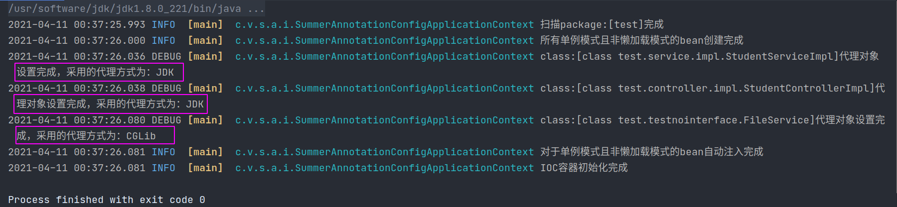

# Summer

[](https://github.com/vfdxvffd/Summer/releases/tag/v1.4) &nbsp;&nbsp;&nbsp;[](Summer使用文档.md) &nbsp;&nbsp;&nbsp;[](Summer更新日志.md)

​		参考`Spring`框架实现一个简易类似的`Java`框架。计划陆续实现`IOC`、`AOP`、以及`数据访问模块和事务控制模块`。项目持续维护中...欢迎Star！Thanks~~~

项目计划：

- [x] IOC容器
- [x] AOP切面
- [ ] 数据访问集成模块（JDBC、事务控制）

​		关于对IOC和AOP功能`为什么要使用（why）`，以及`应该如何使用（how）`请移步[使用文档](Summer使用文档.md)，要了解每个版本更新的内容请移步[更新日志](Summer更新日志.md)。

## 运行环境

JDK 8

## 如何使用

​		下载最新的jar包[](https://github.com/vfdxvffd/Summer/releases/tag/v1.4) ，将其导入项目中，即可使用，目录结构如下图，蓝色框内为`summer`的核心代码，`ch`包下为`logback`日志依赖，`net.sf.cglib`下为cglib动态代理的依赖，`org.slf4j`下为`slf4j`的日志门面依赖。


## Version 1.4

本次更新加入了新功能，修改了一个已知的bug

- 本次更新引入`CGLib`依赖，增加动态代理的方式，对于实现了接口的方法采用`JDK`动态代理来实现切面功能，对于没有实现接口的类采用`CGLib`来实现切面。

    

- 修改bug，之前版本中的`判断当前类是否已经完成了实例对象全部的创建注入工作`的方法，判断没有包含所有情况。

    > bug描述：对于一个没有任何域`且`需要代理的对象，进行注入工作的时候会由于没有域需要注入，从而直接判断其已经完成注入，而跳过了代理阶段。

## Version 1.3

- 本次更新引入了日志依赖，增加了对ioc构造过程中的日志记录

    

- 对于标注了`@Aspect`注解的类自动将其加入IOC容器中，不用再重复标注注解

## Version 1.2

本次更新加入了一些新功能，修复了一些bug

1. 更新功能：

    - aop增加了一种切入方式，目前有以下切入方式

        `@Before`、`@AfterReturning`、`@AfterThrowing`、`@After`

        以上对应的切入时机如下：

        ```java
        try {
            @Before
            fun.invoke();
            @AfterReturning
        } catch (Throwable t) {
            @AfterThrowing
        } finally {
            @After
        }
        ```

    - 切面方法可以通过`JoinPoint`类获取被切的方法的参数、方法名、返回值类型。对于`@AfterReturning`的切入方式可以获取返回值，类型为`Object`，而`@AfterThrowing`可以获取抛出的异常，类型为`Throwable`。

2. 修复了重复代理的bug

    > bug描述：当一个待注入bean中有超过一个需要注入的域（带有注解@Autowired且未完成赋值），如果对它中的方法进行切面，这时切面方法会重复执行

## Version 1.1

​		本次更新主要修复了一些bug，以及优化了代码的结构

1. 修复对于注入对象的切面方法失效的bug

    > bug描述：在controller中注入service，但是如果有对于service的切面方法，则切面方法无法被调用

2. 修复延迟加载的对象注入失败的bug

    > bug描述：对于标注了延迟加载的类注入时会发生异常

3. 修复对非单例的bean注入失败的bug

    > bug描述：对于标注了非单例的类注入时会发生异常，且会调用多次构造函数的问题

4. 增加核心代码的注释。

5. 优化代码结构，重构了大部分冗余的代码块

6. 抽取可重用方法。

## Version 1.0

1. 完成IOC容器的初步搭建

2. 完成AOP功能的简单使用（还需修改）

3. 支持`@Component`、`@Autowired`、`@Qualifier`、`@Value`、`@Repository`、`@Service`、`@Controller`注解的使用
    - @Component（同@Respository、@Service、@Controller）：标注在类上，将此类注册到ioc容器中
    - @Autowired：自动注入ioc容器中的对象
    - @Qualifier：自动注入ioc中对象的时候指定`beanName`，如不指定则按照`beanType`注入
    - @Value：指定将类注入到容器是基本类型（包括包装类）字段的值

4. 支持根据`beanName`、`beanType`获取ioc中的对象

5. 自定义类型转化异常，`@Value`接受`String`类型，如果传入的值并不能正确转化，就抛出`DataConversionException`异常。

6. 增加单例模式与非单例模式的配置注解`@Scope`，以及增加延迟加载的配置注解`@Lazy`

7. 可以使用接口来接受IOC中返回的对象

8. AOP可以对方法进行`@Before`、`@After`、`@AfterThrowing`的切面，需要配置方法的全方法名

9. AOP使用JDK的动态代理，`set`可以不添加，内部实现是直接通过设置域的可访问属性，然后直接设置值

10. 后续计划：
    - 支持根据`xml`配置ioc容器中的对象
    - 对于运行过程可能发生的异常使其尽可能可控，且明确的抛出或处理
    - 对于AOP可选择性的加入`CGLIB`代理
    - 对于AOP一些已注入对象的代理失效bug进行修复（已定位）
    - etc...   for more...
