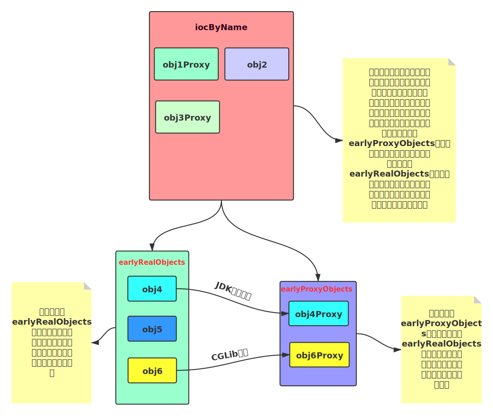
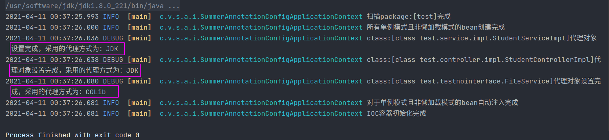
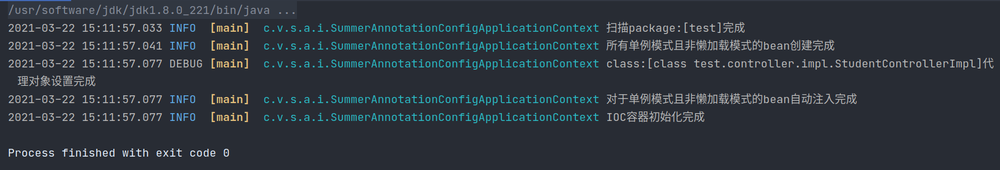

# Summer更新日志

## Version 1.1 (Release)

* 增加@configuration、@bean两个注解，可以通过这两个注解向容器注入配置的bean
* 对于@Configuration注解可以通过指定proxyBeanMethods属性的true或者false来表示是否代理配置类，如果代理则标注了@Bean的方法返回的bean是单例的

## Version 1.0(Release)

本次更新测试了之前的版本的稳定性，以及增加了框架的扩展性，开放出别的框架适配的接口。

- 对之前的`pre-release`版本进行了多次测试以确保稳定性。
- 框架对外开放`Extension`接口，该接口中的方法在`ioc`容器构造的多个阶段进行了切入，增加了框架的可扩展性。
- 如何将自己的框架适配到`Summer`，请看[如何适配summer](如何适配Summer.md)或者可以提[issues](https://github.com/vfdxvffd/Summer/issues)。

## Version 0.5(Pre-release)

<center><b><font size = "6" color = "red">一次重大更新</font></b></center>

>  bug描述：循环依赖的问题复现出来		

​		在最早的版本`v0.0`中采用了`提前暴露对象`的方式解决了循环依赖的问题，其实就是先将所有的`单例且非延迟加载`的对象进行实例化而不进行初始化，存储在容器中，然后再对所有的单例非延迟加载对象进行注入初始化工作，从而解决循环依赖的问题。

​		但是随着开始更新AOP的相关功能，由于需要为对象设置代理，以及本人技术认知的狭窄导致出现了一些bug到现在才发现。

​		由于在`v0.1`版本中为了解决`bug1：修复对于注入对象的切面方法失效的bug`引用了`递归注入的方法`（具体可以翻看`v0.1`的更新日志，有详细介绍）。但这个方法又导致了原来的循环依赖的问题又重现出来（具体表现为A与B循环依赖，当给A注入B的值的时候发现B有未注入的A值，就又去给A注入，给A注入的时候又发现有B这个域没有注入，就又去注入B的值，如此循环往复导致又出现了循环依赖），而之前以为通过`提前暴露对象`的方式解决后就没有过多关注过循环依赖的问题导致这个bug一直没有被发现（还是自己的问题，没有反思为什么spring三级缓存才能解决的问题，自己居然用这么简单的思路去解决，这个问题很值得反思）。


​		当时对代理对象的认知不太全面，私以为只要对对象设置了代理之后就无法更改其中的属性，但现在才明白：`只要修改被代理的原始类，那么代理类的行为会随着一起改变。`（也就是说假如原始类有一个`age`的属性，设置一个方法输出这个age，如果使用代理创建了对应的代理类后，原始类通过某些手段改变`age`的值，那么代理类输出的age也会随着改变。）

​		后面会抽时间出一篇总结`JDK动态代理`和`CGLib代理`的文章，将这段时间学到的东西做一个记录。

**bug解决：**

​		针对目前掌握的代理方面的知识，对之前的做法做出一些调整。设置二级缓存，一级缓存一个（即真正的ioc容器），二级缓存两个，都是负责存放实例化但未初始化的对象，但一个是存放原对象，另一个负责存放代理对象，二级缓存的示意图如下：



将ioc容器的构造过程分为四步来进行：

1. 遍历包，找到所有需要被IOC管理的类，封装成`BeanDefinition`
2. 根据第一步获取到的`BeanDefinition`实例化那些单例且非延迟加载的对象，并将其加入到二级缓存的`earlyRealObjects`中
3. 对第二步得到的`earlyRealObjects`中的对象进行检查，看是否需要设置代理，如果需要则对其进行代理，并将代理对象加入到二级缓存中的`earlyProxyObjects`中（并不删除`earlyRealObjects`中对应的真正的对象）。
4. 对第二步得到的`earlyRealObjects`中的对象进行注入工作（即开始进行初始化），检查每个对象的每个域，如果标注了`@Autowired`注解且值为`null`，则对其进行注入工作，现在一级缓存中查找，如果有直接取出为其注入，如果没有检查二级缓存的`earlyProxyObjects`，如果有则取出为其注入，如果没有则接着检查二级缓存的`earlyRealObjects`，找到后为其注入，此时如果还没有则说明这个域对应的bean是非单例（prototype）模式或者懒加载模式的，则为其实例化并设置代理（如果需要），并初始化，然后注入其中。如果是非ioc容器管理的域，则直接注入`null`，也可以考虑改为抛出异常给用户提示。

## Version 0.4(Pre-release)

本次更新加入了新功能，修改了一个已知的bug

- 本次更新引入`CGLib`依赖，增加动态代理的方式，对于实现了接口的方法采用`JDK`动态代理来实现切面功能，对于没有实现接口的类采用`CGLib`来实现切面。

    

- 修改bug，之前版本中的`判断当前类是否已经完成了实例对象全部的创建注入工作`的方法，判断没有包含所有情况。

    > bug描述：对于一个没有任何域`且`需要代理的对象，进行注入工作的时候会由于没有域需要注入，从而直接判断其已经完成注入，而跳过了代理阶段。

    bug重现：

    ```java
    @Service
    public class FileService {
    
        public void getFile() {
            System.out.println("already get file");
        }
    }
    ```

    ```java
    @Before("test.testnointerface.FileService.getFile()")
    public void testNoInterface() {
        System.out.println("isOk???");
    }
    ```

    对于上述没有一个域的类`FileService`，如果直接去对它进行切面处理的话，会由于下面这个`检查的是否完全完成注入`的方法的判断错误，而直接认为它已经完成注入，从而跳过代理的阶段。

    ```java
    private boolean haveNotWired (Class<?> beanClass) {
        if (beanClass.isInterface()) {          //如果是接口就要去IOC容器中找它的实现类
            beanClass = getImplClassByInterface(beanClass);
        }
        if (beanClass == null) {
            return true;
        }
        if (!allBeansByType.get(beanClass).getSingleton()) {
            //对于非单例
            return true;
        }
        if (Proxy.isProxyClass(getBean(beanClass).getClass()) {
            return false;
        }
        Field[] declaredFields = beanClass.getDeclaredFields();
        for (Field field : declaredFields) {
            Autowired autowired = field.getAnnotation(Autowired.class);
            field.setAccessible(true);
            Object o = field.get(getBean(beanClass));
            if (autowired != null && o == null) {
                return true;
            }
        }
        return false;
    }
    ```

    而对于下面的注入方法，判断完全注入后直接返回，而没有进行下面的代理工作

    ```java
    private void autowireObject (Object object) {
        if (!haveNotWired(object.getClass())) {
            return;
        }
        ... /// 这里忽略一段代码
        setProxy(beanClass);        // 设置代理（内部会先检查是否需要代理）
    }
    ```

    **bug修改办法就是修改判断是否完全注入的函数，对于需要代理但还没有代理的对象则视为没有完全注入**

    ```java
    private boolean haveNotWired (Class<?> beanClass) {
        if (beanClass.isInterface()) {          //如果是接口就要去IOC容器中找它的实现类
            beanClass = getImplClassByInterface(beanClass);
        }
        if (beanClass == null) {
            return true;
        }
        if (Proxy.isProxyClass(beanClass)) {
            return false;
        }
        if (!allBeansByType.get(beanClass).getSingleton()) {
            //对于非单例
            return true;
        }
        if (Proxy.isProxyClass(getBean(beanClass).getClass())) {
            return false;
        }
        if (aspect.containsKey(beanClass)) {    //对于需要代理但还没有代理的对象则视为没有完全注入
            return true;
        }
        Field[] declaredFields = beanClass.getDeclaredFields();
        for (Field field : declaredFields) {
            Autowired autowired = field.getAnnotation(Autowired.class);
            field.setAccessible(true);
            Object o = field.get(getBean(beanClass));
            if ((autowired != null && o == null)) {
                return true;
            }
        }
        return false;
    }
    ```

## Version 0.3(Pre-release)

- 本次更新引入了日志依赖，增加了对ioc构造过程中的日志记录

    

- 对于标注了`@Aspect`注解的类自动将其加入IOC容器中，不用再重复标注注解

## Version 0.2(Pre-release)

本次更新加入了一些新功能，修复了一些bug

1. 更新功能：

    - aop增加了一种切入方式，目前有以下切入方式

        `@Before`、`@AfterReturning`、`@AfterThrowing`、`@After`

        以上对应而切入时机如下：

        ```java
        try {
            @Before
            fun.invoke();
            @AfterReturning
        } catch (Throwable t) {
            @AfterThrowing
        } finally {
            @After
        }
        ```

    - 切面方法可以通过`JoinPoint`类获取被切的方法的参数、方法名、返回值类型。对于`@AfterReturning`的切入方式可以获取返回值，类型为`Object`，而`@AfterThrowing`可以获取抛出的异常，类型为`Throwable`。

2. 修复了重复代理的bug

    > bug描述：当一个待注入bean中有超过一个需要注入的域（带有注解@Autowired且未完成赋值），如果对它中的方法进行切面，这时切面方法会重复执行

    bug重现：

    ```java
    @Controller
    public class StudentControllerImpl implements StudentController {
        @Autowired
        private StudentService studentService;
        @Autowired
        private BookService bookService;
    	
        public void fun() {
            //被切的方法
        }
    }
    ```

    如果对以上的`fun`方法进行切面，切面方法会重复执行。

    **分析：**

    ```java
    for (Field field : declaredFields) {
        ...			//一些检查和注入的代码
        setProxy(beanClass);        // 设置代理（内部会先检查是否需要代理）
    }
    ```

    ​		由上述代码可以看出是由于将设置代理的方法写到了对域遍历的for循环中，而导致对每一个域检查的时候都会设置一次代理。

    ​		修改时只需将设置代理的方法提出，每个class只需检查执行一次即可。

## Version 0.1(Pre-release)

​		本次更新主要修复了一些bug，以及优化了代码的结构

1. 修复对于注入对象的切面方法失效的bug

    > bug描述：在controller中注入service，但是如果有对于service的切面方法，则切面方法无法被调用

    **分析：**

    ​		因为在之前的IOC容器初始化时的顺序是：`获取所有标了注解的类并保存起来——>创建对象并对标注了@value的域赋值——>用容器中的bean注入标注了@Autowired的对象属性——>将被切面切的类包装为代理对象重新覆盖IOC容器中的bean`

    ​		从上述的顺序其实可以看出，在第三步已经将service注入了controller中，第四步再更新容器中的service（将其变为代理对象）已经改变不了controller中的service了，而且更重要的是：**破坏了单例模式**。所以这属于是一个极为严重的bug.

    ​		对其做出以下修正：改变IOC容器的初始化顺序，第一步和第二步不变，将第三步和第四步混合为一步。对一个对象的域进行注入时（比如对controller中的service），先检查该对象（controller）是否已经完成了注入，如果完成了则直接继续循环其他对象。如果没完成，则循环检查它的每个标注了`@Autowired`的域对应的对象（service）是否已经完成了所有注入工作，如果没完成就递归调用`注入方法`为该域所对应的对象进行注入工作，如果完成了就对该对象（controller）的每个域进行注入工作。对该对象（controller）注入完成后检查它是否需要被包装为代理对象，如果需要则将包装的代理对象覆盖如IOC容器，如果不需要就直接加入IOC容器。

    ```java
    public void autoWired(Set<Class<?>> classes) {
        for (Class<?> clazz : classes) {
            autoWired(clazz);
        }
    }
    
    public void autoWired(clazz) {
        if (clazz 已经完成了注入工作) {
            return;
        }
        for (Field field : clazz中所有标注@AutoWired的域) {
            if (field.getType()未完成注入工作)	{	//即容器中还没有完整的该类的bean
                autoWired(field.getType());
            }
            set(field, ioc.getBean(field.getType()));
        }
        if (需要包装为代理对象) {
            Object obj = getProxyObj(clazz);
            ioc.put(obj);		//覆盖
        } else {
            ioc.add (clazz.toObj());
        }
    }
    ```

2. 修复延迟加载的对象注入失败的bug

    > bug描述：对于标注了延迟加载的类注入时会发生异常

    **分析：**

    ​		因为有一个方法将接口转化为实现类对象，之前是在ioc容器中找实现类，而对于延迟加载的类来说，ioc中初始并没有该类，所以获取不到，返回null就抛出异常。

    ​		之后修改不从ioc容器中找，而是从整个标注了组件表示的类中找，避免了此bug。

3. 修复对非单例的bean注入失败的bug

    > bug描述：对于标注了非单例的类注入时会发生异常，且会调用多次构造函数的问题

    **分析：**

    ​		判断某个域是否完成注入的时候会调用`Proxy.isProxyClass(getBean(beanClass).getClass()`方法判断是否为代理类，对于`非单例`的bean调用`getBean`的时候回去创建bean，而创建bean的时候又会来判断是否已经完成注入，这样造成循环调用出现异常。

    ​		修改bug：需要在判断是否为代理对象前判断是否为`非单例`的bean,如果是直接返回`未完全注入所有域`。

    ​		对于调用多次构造函数的问题，举个例子：controller里面有service域为`非单例`需要注入，将controller保存到容器的时候回去递归注入service，但这时候调用的`autowireObject (BeanDefinition beanDefinition)`**在创建完bean之后并不会将其装入IOC容器中**，因为它默认传入的是上次调用`createObject(BeanDefinition beanDefinition)`时已经装入容器的对象，所以调用结束后这个对象相当于没有创建（未装入容器，也未保存）。而当运行到下述代码时候（即将刚刚创建的service注入到controller中），调用`getBean`方法发现IOC中并没有期望的bean，所有又会去创建，此时会以`非单例`模式创建，所以这个对象又会被创建一次。

    ```java
    //by Type
    try {
        field.setAccessible(true);
        field.set(getBean(beanDefinition.getBeanName()), getBean(field.getType()));
    } catch (Exception e) {
        e.printStackTrace();
    }
    ```

    修改bug：对于`autowireObject (BeanDefinition beanDefinition)`，如果传入的是`非单例`模式的则不予创建对象，直接返回，因为后面`getBean`被调用的时候还会创建bean，而且是以`非单例`的方式，更加合适。

    ps：非单例创建bean的方法我贴在下面：

    ```java
    //非单例则不需要将其加入ioc容器
    Object object = createObject(beanDefinition);
    if (object != null) {
        autowireObject(object);
    } else {
        return null;
    }
    return (T) object;
    ```

4. 增加核心代码的注释。

5. 优化代码结构，重构了大部分冗余的代码块

6. 抽取可重用方法。

## Version 0.0(Pre-release)

1. 完成IOC容器的初步搭建

2. 完成AOP功能的简单使用（还需修改）

3. 支持`@Component`、`@Autowired`、`@Qualifier`、`@Value`、`@Repository`、`@Service`、`@Controller`注解的使用
    - @Component（同@Respository、@Service、@Controller）：标注在类上，将此类注册到ioc容器中
    - @Autowired：自动注入ioc容器中的对象
    - @Qualifier：自动注入ioc中对象的时候指定`beanName`，如不指定则按照`beanType`注入
    - @Value：指定将类注入到容器是基本类型（包括包装类）字段的值

4. 支持根据`beanName`、`beanType`获取ioc中的对象

5. 自定义类型转化异常，`@Value`接受`String`类型，如果传入的值并不能正确转化，就抛出`DataConversionException`异常。

6. 增加单例模式与非单例模式的配置注解`@Scope`，以及增加延迟加载的配置注解`@Lazy`

7. 可以使用接口来接受IOC中返回的对象

8. AOP可以对方法进行`@Before`、`@After`、`@AfterThrowing`的切面，需要配置方法的全方法名

9. AOP使用JDK的动态代理，`set`可以不添加，内部实现是直接通过设置域的可访问属性，然后直接设置值

10. 后续计划：
    - 支持根据`xml`配置ioc容器中的对象
    - 对于运行过程可能发生的异常使其尽可能可控，且明确的抛出或处理
    - 对于AOP可选择性的加入`CGLIB`代理
    - 对于AOP一些已注入对象的代理失效bug进行修复（已定位）
    - etc...   for more...